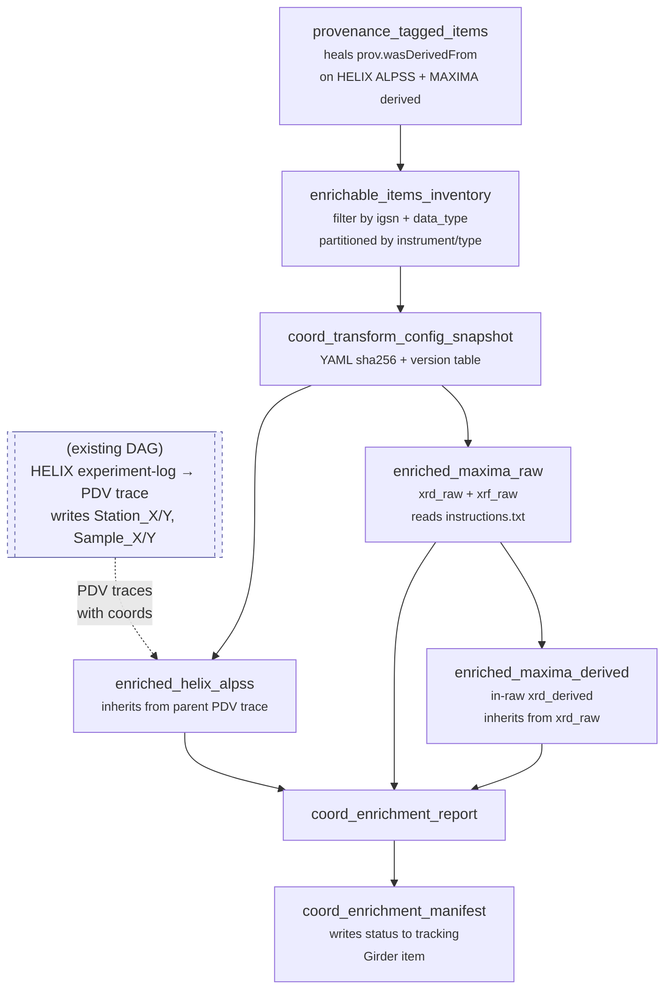

# Coordinate Enrichment DAG — One-Page Brief

## The problem

AIMD-L instruments record shot positions in instrument-specific coordinate
frames (millimeters from each station's mechanical zero). Downstream
scientific work needs **sample-frame coordinates** — positions relative to
the sample itself — so that measurements from HELIX (laser shock),
MAXIMA (XRD/XRF), and future instruments can be compared at the same
physical location on the same sample. The `coordinate-transformer` PyPI
package performs the instrument→sample affine transform per instrument
and carries **versioned calibrations** so that historical data is
transformed with the calibration in effect on the day of acquisition.

Today, those transforms happen only for HELIX PDV traces via a
spreadsheet-driven Dagster job. The new DAG described here propagates
sample coordinates to every AIMD-L Girder item that (a) carries an IGSN
and (b) has a recognized instrument data type, doing so with full
provenance so any coordinate value can be traced to an authoritative
station-side source artifact.

## The DAG

## What each part does

| Asset | Writes to Girder? | Role |
|---|---|---|
| `provenance_tagged_items` | yes (prov only) | Makes `meta.prov.wasDerivedFrom` reliable everywhere it's needed, by matching ALPSS items to parent PDV traces by filename stem and healing dangling MAXIMA prov pointers. |
| `enrichable_items_inventory` | no | Queries `/aimdl/datafiles` for each in-scope `data_type`, keeps only items with `meta.igsn`, partitions by `(instrument, data_type)`. |
| `coord_transform_config_snapshot` | no | Captures the transform YAML's sha256, version list, and the `coordinate-transformer` package version. Every enrichment write embeds this snapshot in its provenance. |
| `enriched_maxima_raw` | yes (coords + prov) | For each `xrd_raw` / `xrf_raw`: parse scan-point index from filename, walk to the run folder's `instructions.txt`, read the corresponding `sample.scan_points[i]`, transform using `meta.experiment_date` for version selection, write. |
| `enriched_helix_alpss` | yes (coords + prov) | For each ALPSS item: follow `prov.wasDerivedFrom` to its PDV trace, copy `Station_X/Y` and the transform timestamp, recompute `Sample_X/Y` with provenance. |
| `enriched_maxima_derived` | yes (coords + prov) | Same inheritance pattern but following `wasDerivedFrom` to the master.h5 within the run folder. |
| `coord_enrichment_report` | no | Aggregates per-partition counts: seen, skipped-by-policy, written, transform failures, unresolved parents. |
| `coord_enrichment_manifest` | yes (status record) | Writes a job-level processing summary to a tracking Girder item. |

## Coordinate authorities

Every coordinate value traces, in at most two hops, back to one of two
station-side authoritative artifacts:

| Instrument | Authority | How station coords are read |
|---|---|---|
| HELIX | experiment-log CSV | `Flyer_X/Y_Position_Corrected (mm)` column from the row whose `PDV_FileName` matches |
| MAXIMA | `instructions.txt` (JSON) | `sample.scan_points[i]` where `i` is the scan-point index parsed from the filename |

## Key policies

- **Scope gate.** An item is enriched iff `meta.igsn` is set, `meta.data_type` is in the allowed set, and (for `xrd_derived`) the item's parent folder is named `raw`. Everything else silently drops out.
- **MAXIMA root-level TIFFs are explicitly NOT enriched.** They are not scientifically validated imagery and adding coordinates to them would invite unwarranted interpretations. The path-based scope gate excludes them by construction.
- **Overwrite if the transform changed.** A write occurs only when the new `coord_provenance` would differ from what's stored (different YAML sha256, transformer version, or station_coord_source). Re-running after a YAML recalibration re-enriches affected items and leaves the rest alone.
- **Parent missing is a skip, not a crash.** If a derived item's `prov.wasDerivedFrom` target doesn't resolve, the item is reported as unresolved and the DAG moves on. Other partitions continue.
- **No silent fallbacks on timestamps.** If a MAXIMA item lacks `meta.experiment_date` (future Eiger-HDF5 fallback), the failure is explicit — we do not guess.
